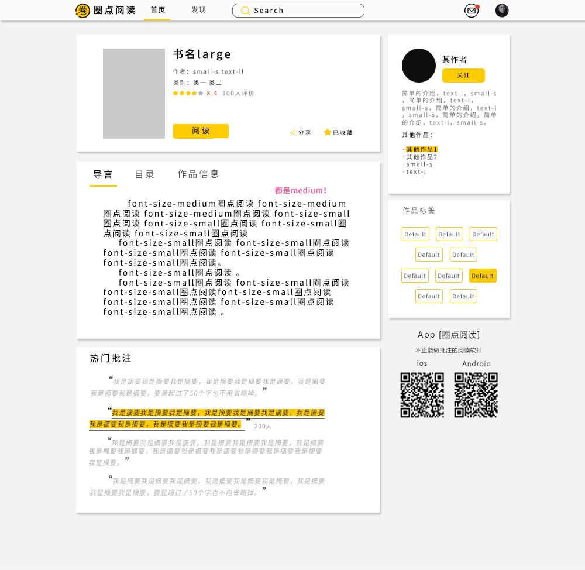

# Intelligent-annotation-system
智能批注系统

## 目录

[文档编辑规范](#文档编辑规范)

- [开发进度](#开发进度)
- [需求分析](#需求分析)
  - [规范符号批注的种类及用法](#规范符号批注的种类及用法)
    - [确定批注方式](#确定批注方式)
    - [问题列表](#问题列表)
  - [规范文字批注的类型及用法](#规范文字批注的类型及用法)
    - [文字批注的类型](#文字批注的类型)
    - [文字批注的界面](#文字批注的界面)
  - [智能抽取书中某个段落展示以往所有学生及教师提交的批注](#智能抽取书中某个段落展示以往所有学生及教师提交的批注)
    - [用户画像](#用户画像)
  - [提供能够方便教师授课的批注操作界面](#提供能够方便教师授课的批注操作界面)
  - [智能分析批注较优秀的书籍及学生作品并予以展示](#智能分析批注较优秀的书籍及学生作品并予以展示)
  - [提供优秀学生读者排行及优秀书籍排行](#提供优秀学生读者排行及优秀书籍排行)
  - [统计所有批注并能进行数据挖掘及应用分析](#统计所有批注并能进行数据挖掘及应用分析)
- [技术栈](#技术栈)
  - [前端](#前端)
  - [后台接口](#后台接口)
  - [机器学习项目](#机器学习项目)
  - [网络爬虫](#网络爬虫)
  - [存储](#存储)
  - [移动端](#移动端)
- [数据库结构](#数据库结构)
- [接口](#接口)
- [界面设计](#界面设计)
  - [大屏网页版](#大屏网页版)
- [智能判断优秀批注](#智能判断优秀批注)
  - [样本](#样本)
    - [数据来源](#数据来源)
    - [数据筛选](#数据筛选)
    - [数据处理](#数据处理)

## 文档编辑规范

- 添加内容前先检查目录，确定将要添加的内容不会和现有内容重复
- 如果插入了新的**标题**，请在目录相应位置增加**链接**，GitHub支持的格式为`[目录名](#标题名)`
- 内容分析时如果**引入**了外部文档，请使用`>`标签表示引用，引用中换行需要两个回车
- **特殊符号**或**变量名**使用两个\`符号包裹，如`tensorflow`
- 如果需要**插入图片**，将图片放在`images`目录下，引入图片的格式为``
- 开发进度中，需要完成的项目使用`- [ ] 内容`标记，完成后使用`- [x] 内容`标记

## 开发进度

截止至 2018-10-08

- 数据库
  - [ ] 填入若干用于测试的内容
  - [ ] 批注需要添加字段来表示权重，用于排序
  - [ ] 用户表添加字段存储用户画像向量
- 前端
  - [ ] 登陆页面
  - [ ] 注册页面
  - [ ] Search组件
  - [ ] 和服务端对接
  - [ ] 修改样式
- 服务端后台
  - [ ] 书籍推荐
  - [ ] 热门文章
  - [ ] 优秀批注
  - [ ] 热门分类
  - [ ] 优秀学生
  - [ ] 优秀老师
- 爬虫项目
  - [ ] 需要解决设置代理的问题
- 算法部分
  - [ ] 重构CNN网络
    - [ ] 根据系统重新定制
    - [ ] 删除py2部分
  - [ ] 对运行接口做高层抽象，方便其他项目调用
  - [ ] 尝试对样本分词，看看能不能提高训练效率，测试结果：
- 开发要求：对所有代码添加尽可能详细的注释，做到能够让其他组员快速读懂代码逻辑并能修改代码，修改情况：
  - [ ] 前端
  - [ ] 后台
- 学习内容：
  - [ ] 前端学习Vue.js，进度：

截止至 2018-09-24

- [x] 后台修改了数据库`insert`函数，修复了bug
- [x] 前端完成首页样式，内容见[界面设计：大屏网页版](#大屏网页版)
- [x] 前端完成书籍详情页，内容见[书籍详情页](#书籍详情页)
- [x] 前端完成基本的路由配置，抽象出部分组件等待复用
- [x] 后台数据库中填入若干用于测试的内容
- 后台完成提供首页内容的接口，包括
  - [x] 登录注册
- 建立爬虫项目，收集短评样本用于以后实现判断批注是否优秀
  - [x] 完成下载模块
  - 完成解析器
    - [x] 解析豆瓣图书TOP250
    - [x] 解析图书详情页
    - [x] 解析短评页面
  - [x] 完成任务队列
  - [x] 完成存储器
  - [x] 完成调度器
- 数据库需要修改：
  - [x] 文章需要图片字段
  - [x] 批注有回复功能，需要存储每条批注的回复
  - [x] 批注有赞同和反对数量
  - [x] 用户表添加了一个管理员用户，用户名`admin`，密码`admin`
- 学习内容：
  - [x] 前端学习stylus，进度：学好了，但是写代码速度太慢，等后期重构，前期开发暂不使用stylus
  - [x] 后台学习python flask，进度：flask接口部分都差不多学完了（模板啥的反正不用）
  - [x] 后台学习文本特征提取，进度：基本完成

## 需求分析

### 规范符号批注的种类及用法

> 直线`_`画在生字或需要解释的词语下，用以批注时注音或解词
>
> 圈字码`① ② ③`用来标示自然段的序号，便于查找内容
>
> 波浪线`～`画在自己欣赏、或是文章中的关键语句下面， 以便加深记忆、理解
>
> 圈点`。`标在文中的重点词或优美词语下面
>
> 三角号`Δ`标出句子的关键词
> 
> 自己阅读到有疑问的地方可以批注`?`并写出自己的疑问
> 
> 感叹号`!`用在自己有感叹或惊奇的语句旁边，可以抒写所感
> 
> 分段号`//`用来划分段落，可以附注书写段落大意
> 
> 分层号`/`用来划分层次，可以附注书写层次大意

#### 确定批注方式

- 用户选中部分内容后弹出浮动选项栏以供选择
- 为什么选中后弹出？设计成选择内容后直接弹出是为了同时适配手机和电脑的网页版，手机浏览器内无法使用右键点击（后面也许会想到更好的交互逻辑）.
- 选项包括“注释”、“喜欢”、“提问”、“重点”、“[文字](#文字批注的界面)”五项（可以设计成图标或符号），点击后为选中内容添加对应批注符号
  - “注释”功能可拥有二级菜单“注音”、“释义”（可以设计成图标或符号）
  - “注音”将在选定内容顶部标注汉语拼音
  - “释义”将对接百度百科，提供名词解释和词条跳转功能，添加了释义的内容将更改为特定样式（具体样式需要设计），并在点击时弹出释义卡片，如
  - 
- “提问”功能将在侧面打开（大屏）或跳转到（小屏）[问题列表](#问题列表)

#### 问题列表

- 该列表显示当前选中内容（或包含该内容）的所有提问
- 右上角设置“添加问题”按钮
- 问题页面应该能看到选中的内容，如果选中的是词语、短语，则应该能看到上下文（简单通过字数判断）
- 点击问题可进入详情
  - 详情可以查看完整问题
  - 详情可以查看已有的回答并点赞
  - 详情可以添加自己的回答
  - 每个用户在同一问题下只能添加一个答案
  - 用户可以修改和删除自己的回答

### 规范文字批注的类型及用法

#### 文字批注的类型

- 感想式
- 评价式
- 理解式

#### 文字批注的界面

- 用户点击“文字”后，弹出简单编辑器（简单的文字批注不需要富文本）
- 编辑器底部应当有批注类型的单选选择器并默认为理解式（默认选项待定）
- 提交后，选中部分应该改变样式表示该内容存在批注，大屏设备可直接将批注显示在右侧

### 智能抽取书中某个段落展示以往所有学生及教师提交的批注

#### 用户画像

- 对用户行为进行分析和学习，绘制用户画像来推测用户可能喜欢的段落
- 在用户可能喜欢的段落旁添加标记（小屏）或直接滚动显示（大屏）优秀批注

### 提供能够方便教师授课的批注操作界面

### 智能分析批注较优秀的书籍及学生作品并予以展示

### 提供优秀学生读者排行及优秀书籍排行

### 统计所有批注并能进行数据挖掘及应用分析

## 技术栈

### 前端页面

- HTML, CSS, JavaScript
- Vue.js
- Vue - VueRouter => Vue路由管理
- Vue - VueX => Vue数据管理
- Vue - axios => Vue请求工具
- Vue - iview => VueUI组件库

### 后台接口

- Python
- Python - virtualenv => Python虚拟环境
- Python - Flask => Web应用框架
- Python - pymysql => MySQL连接库

### 机器学习项目

- Python - tensorflow => 机器学习框架
- Python - tensorboard => 可视化训练结果
- Python - jieba => 分词

### 网络爬虫

- Python - requests => 请求页面
- Python - pyquery => html解析器
- Python - redis => redis数据库接口

### 存储

- MySQL
- Redis

### 移动端

- 待定

## 数据库结构

用户表：user

| Column   | Datatype     | PrimaryKey | NotNull | Default           | Comments | Extra                    |
| -------- | ------------ | ---------- | ------- | ----------------- | -------- | ------------------------ |
| id       | int(11)      | yes        | yes     | AI                | 用户id   |                          |
| username | varchar(20)  | no         | yes     |                   | 用户名   |                          |
| email    | varchar(45)  | no         | no      |                   | 邮箱     |                          |
| phone    | varchar(20)  | no         | no      |                   | 手机     |                          |
| password | varchar(200) | no         | yes     |                   | 密码     |                          |
| nickname | varchar(45)  | no         | no      |                   | 昵称     |                          |
| token    | varchar(25)  | no         | no      |                   | TOKEN    |                          |
| group    | int(11)      | no         | yes     |                   | 用户组   | 1-管理员\|2-教师\|3-学生 |
| date     | timestamp    | no         | yes     | current_timestamp | 注册时间 |                          |

文章表：article

| Column    | Datatype    | PrimaryKey | NotNull | Default           | Comments       |
| --------- | ----------- | ---------- | ------- | ----------------- | -------------- |
| id        | int(11)     | yes        | yes     | AI                | 文章id         |
| title     | varchar(45) | no         | yes     |                   | 文章标题       |
| author | varchar(20) | no | yes | "未知作者" | 文章作者 |
| image_path | varchar(200) | no | no | NULL | 标题图片的路径 |
| file_path | varchar(200) | no         | yes     |                   | 文章内容的路径 |
| uploader  | int(11)     | no         | yes     |                   | 上传人         |
| state     | int(11)     | no         | yes     |                   | 审核状态        |
| date      | timestamp   | no         | yes     | current_timestamp | 上传时间       |

文章类型表：article_tag

| Column     | Datatype    | PrimaryKey | NotNull | Default | Comments | Extra       |
| ---------- | ----------- | ---------- | ------- | ------- | -------- | ----------- |
| id         | int(11)     | yes        | yes     | AI      | id       |             |
| article_id | int(11)     | no         | yes     |         | 文章id   | foreign key |
| tag        | varchar(20) | no         | yes     |         | Tag      |             |

批注表：comments

| Column         | Datatype  | PrimaryKey | NotNull | Default           | Comments     | Extra       |
| -------------- | --------- | ---------- | ------- | ----------------- | ------------ | ----------- |
| id             | int(11)   | yes        | yes     | AI                | 批注id       |             |
| article_id     | int(11)   | no         | yes     |                   | 文章id       | foreign key |
| user_id        | int(11)   | no         | yes     |                   | 批注人id     |             |
| paragraph      | int(11)   | no         | yes     |                   | 自然段       |             |
| start_index    | int(11)   | no         | yes     |                   | 开始索引     |             |
| end_index      | int(11)   | no         | yes     |                   | 结束索引     |             |
| type           | int(11)   | no         | yes     |                   | 批注类型     |             |
| text           | text      | no         | no      |                   | 文字批注内容 |             |
| agree_count    | int       | no         | yes     | 0                 | 赞同数       |             |
| disagree_count | int       | no         | yes     | 0                 | 反对数       |             |
| date           | timestamp | no         | yes     | current_timestamp | 批注时间     |             |

## 接口

接口规范

- 返回值
  - 类型：json
  - 字段：
    - code：操作状态码
    - msg：错误提示
    - data：返回数据
    
接口详情
- 账户
  - 用户登录 /api/account/login()
    - 参数
        - username ：用户名
        - password ：密码
    - 返回值
        - code ：0 = 未知用户，-1 = 未成功初始化token，1 = 成功
        - msg ：信息
        - data ：
            - token ：用户标识
            - group ：用户群组
  - 用户登出 /api/account/logout()
    - 参数
        - token ：用户标识
    - 返回值
        - code ：0 = 未知用户，1 = 成功
        - msg ：信息
  - 用户注册 /api/account/signup()
    - 参数
        - username ：用户名
        - password ：密码
        - phone ：手机号
        - email ：EMail
        - nickname ：昵称
        - group ：用户组
    - 返回值
        - code ：0 = 用户名已存在，-1 = EMail已存在，-2 = 手机号已存在，-3 = 未知错误，1 = 成功
        - msg ：信息
  - 用户名检测 /api/account/check_username_available()
    - 参数
        - username ：用户名
    - 返回值
        - code ：0 = 不可用，1 = 可用
        - msg ：信息
  - 手机号检测 /api/account/check_phone_available()
    - 参数
        - phone ：手机号
    - 返回值
        - code ：0 = 不可用，1 = 可用
        - msg ：信息
  - 邮箱检测 /api/account/check_email_available()
    - 参数
        - email ：邮箱
    - 返回值
        - code ：0 = 不可用，1 = 可用
        - msg ：信息
- 读书
  - 通过书籍ID获取书籍详情 /api/reading/get_book_info()
    - 参数(通过路由 事例：/api/reading/get_book_info/1)
        - id ：文章id 
    - 返回值
        - code ：0 = 未知书籍，1 = 成功
        - msg ：信息
        - data 
            - id ：文章id
            - title ：文章标题
            - file_path ：文章内容地址
            - uploader ：上传人
            - state ：文章状态 0 = 未审核，1 = 已审核，-1 = 未通过审核或下架
            - date ：文章上传日期
  - 首页文章推荐 /api/reading/article_recommend()
    - 参数
        - token ：用户token
    - 返回值
        - code ：0 = 未知用户， 1 = 成功
        - msg ：信息
        - data
            - 数组
                - id ：文章id
                - title ：文章标题
                - file_path ：文章内容地址
                - uploader ：上传人
                - date ：文章上传日期
                - cover ：封面
                - author ：作者
                - num_comment ：评论数
                - like ：点赞数量
  - 首页优秀批注推荐 /api/reading/comment_recommend()
    - 参数
        - token ：用户token
    - 返回值
        - code ：0 = 未知用户，1 = 成功
        - msg ：信息
        - data
            - 数组
                - id ：批注id
                - book_id ：文章id
                - book_name ：文章标题
                - comment ：批注内容
                - comment_uploader ：批注上传人
                - comment_sentence ：批注目标段落
                - num_comment ：评论数
                - like ：点赞数量
  - 首页热门分类 /api/reading/tag_recommend()
    - 参数
        - token ：用户token
    - 返回值
        - code ：0 = 未知用户，1 = 成功
        - msg ：信息
        - data
            - 数组
                - id ：tag id
                - name ：分类名称
- 用户
    - 首页推荐老师 /api/user/teacher_recommend()
        - 参数
            - token ：用户token
        - 返回值
            - code ：0 = 未知用户，1 = 成功
            - msg ：信息
            - data
                - 数组
                    - id ：用户id
                    - name ：用户昵称
                    - school ：来自学校
                    - introduce ：简介
    - 首页推荐学生 /api/user/student_recommend()
        - 参数
            - token ：用户token
        - 返回值
            - code ：0 = 未知用户，1 = 成功
            - msg ：信息
            - data
                - 数组
                    - id ：用户id
                    - name ：用户昵称
                    - school ：来自学校
                    - introduce ：简介
- 信息
    - 通知信息
        - 参数
            - token ：用户token
        - 返回值
            - 数组
                - code ：0 = 未知用户，1 = 成功
                - msg ：信息
                - data
                    - 数组
                        - 待定
- 上传
    - 上传文章
        - 参数
            - article ：文章文件
            - image ：封面
            - title ：标题
            - token ：用户token
            - author ：作者
        - 返回值
            - code ：0 = 未知用户，-1 = 未知错误，1 = 成功
            - msg ：信息
- 杂项
    - ping /api/check_server()
        - 参数
            - 无
        - 返回值
            - code ：1 = 成功
            - msg ：信息
## 界面设计

### 大屏网页版

- 首页
  - 
  - 导航栏
    - logo
    - 首页
    - 发现（排行）
    - 搜索
    - 通知
  - 推荐
    - 热门文章
    - 文章简介
    - 优秀批注
  - 侧边栏
    - 热门分类链接
    - 下载App等
    - 优秀教师推荐
    - 优秀学生推荐

- 文章详情页

  + 

  + 书籍简介
    + 书名
    + 作者
    + 标签
    + 评分
    + 分享、收藏
    + 阅读

  + 目录板块
    + 导言
    + 目录
    + 作品信息

  + 热门批注
  + 侧边栏
    + 作者简介
    + 热门分类
    + app下载

- 阅读页面

  - 工具栏
    - 目录
      - 目录
      - 批注
    - 设置
    - 书架
    - 读后感
    - 点赞/推荐
    - 返回顶部
  - 阅读区域
    - 选中菜单
      - 喜欢
      - 重点
      - 注释（查询）
      - 更多
        - 添加批注
        - 查看批注
  - 批注区域
    - 默认隐藏
    - 显示优秀批注列表
    - 从阅读区域右侧弹出，弹出时阅读区域左移
    - 点击添加批注时在顶部加入编辑框
    - 列表右下角有添加批注按钮

## 智能判断优秀批注

利用机器学习，利用大量样本训练得到可以判断批注是否优秀的模型

### 样本

#### 数据来源

豆瓣评分 > 7.0的图书短评

#### 数据筛选

优秀评论：

- 评论字数 > 15
- 评论星星数 >= 4 
- 评论被评为“有用”的次数 > 400

非优秀评论：

- 评论字数 <= 15
- 评论星星数 <= 3
- 评论被评为“有用”的次数 == 0
- 评论包含敏感词

#### 数据处理

1. 分词：使用结巴分词对短评进行分词，去掉停用词
2. 建立两个目录，分别用于存储优秀评论和非优秀评论，评论在目录下的存储形式为`[索引].txt`，每条评论存为一个文件