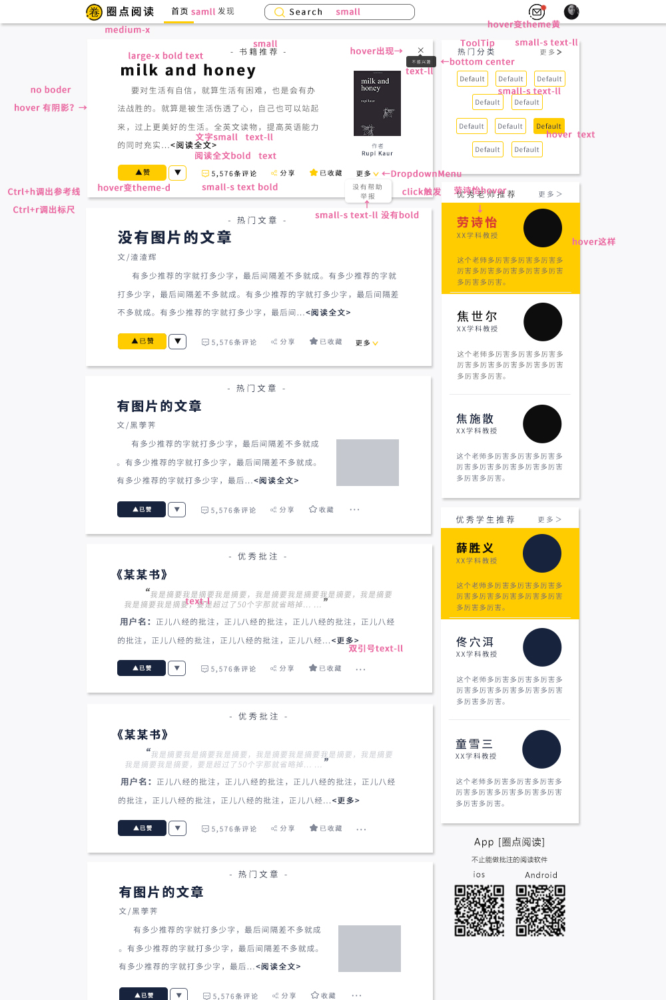

# INTELLIGENT-ANNOTATION-SYSTEM

课外阅读智能批注系统

## Table of Contents 目录

   * [INTELLIGENT-ANNOTATION-SYSTEM](#intelligent-annotation-system)
      * [Table of Contents 目录](#table-of-contents-目录)
      * [Process 开发进度表](#process-开发进度表)
      * [Server 服务端](#server-服务端)
         * [Environment 开发环境](#environment-开发环境)
         * [API 接口](#api-接口)
            * [Design 设计思路](#design-设计思路)
            * [Format 格式约定](#format-格式约定)
            * [Document 文档](#document-文档)
               * [Account 账户](#account-账户)
               * [Reading 读书](#reading-读书)
               * [User 用户](#user-用户)
               * [Information 信息](#information-信息)
               * [Other 杂项](#other-杂项)
         * [Database 数据库](#database-数据库)
            * [Design 设计思路](#design-设计思路-1)
            * [Structure 结构](#structure-结构)
      * [WEB-APP 网页应用](#web-app-网页应用)
         * [Environment 开发环境](#environment-开发环境-1)
         * [Page&amp;Function 页面和功能](#pagefunction-页面和功能)
            * [Design 设计思路](#design-设计思路-2)
            * [Draft 设计稿](#draft-设计稿)
            * [交互逻辑](#交互逻辑)
      * [移动应用](#移动应用)

Created by [gh-md-toc](https://github.com/ekalinin/github-markdown-toc)

## Process 开发进度表

2018-10-08

----

<table>
    <tr>
        <td rowspan="2"><strong>服务端</strong></td>
        <td><strong>接口</strong></td>
        <td>书籍推荐</td>
        <td>热门文章</td>
        <td>优秀批注</td>
        <td>热门分类</td>
        <td>优秀学生</td>
        <td>优秀老师</td>
    </tr>
    <tr>
        <td><strong>核心算法</strong></td>
        <td>解决代理的问题</td>
        <td>重构CNN网络</td>
        <td colspan="2">对运行接口做高层抽象，方便其他项目调用</td>
        <td colspan="2">尝试对样本分词，看看能不能提高训练效率</td>
    </tr>
    <tr>
        <td rowspan="2"><strong>网页应用</strong></td>
        <td><strong>设计</strong></td>
        <td colspan="3">登陆页面</td>
        <td colspan="3">注册页面</td>
    </tr>
    <tr>
        <td><strong>制作</strong></td>
        <td>登陆页面</td>
        <td>注册页面</td>
        <td>Search</td>
        <td colspan="2">和服务端对接</td>
        <td>修改样式</td>
    </tr>
    <tr>
        <td colspan="2"><strong>数据库</strong></td>
        <td colspan="2">填入若干用于测试的内容</td>
        <td colspan="2">批注需要添加字段来表示权重，用于排序</td>
        <td colspan="2">用户表添加字段存储用户画像向量</td>
    </tr>
</table>


2018-09-24 √

----

<table>
    <tr>
        <td rowspan="2"><strong>服务端</strong></td>
        <td><strong>接口</strong></td>
        <td colspan="2">登陆 √</td>
        <td colspan="2">注册 √</td>
    </tr>
    <tr>
        <td><strong>核心算法</strong></td>
        <td colspan="4">基于CNN的长句分类DEMO √</td>
    </tr>
    <tr>
        <td rowspan="2"><strong>网页应用</strong></td>
        <td><strong>设计</strong></td>
        <td colspan="2">首页 √</td>
        <td colspan="2">书籍详情页 √</td>
    </tr>
    <tr>
        <td><strong>制作</strong></td>
        <td>首页 √</td>
        <td>书籍详情页 √</td>
        <td>完成基本的路由配置 √</td>
        <td>抽象出部分组件等待复用 √</td>
    </tr>
</table>


## Server 服务端

### Environment 开发环境

```shell
Language:
	Python3.6
Virtual Environment:
	$ python -m venv venv       # 创建python虚拟环境
	$ source venv/bin/activate  # 进入虚拟环境
	$ deactivate                # 退出虚拟环境
Packages:
    Flask==1.0.2
    jieba==0.39
    numpy==1.14.5
    PyMySQL==0.9.2
    pyquery==1.4.0
    redis==2.10.6
    requests==2.19.1
    scipy==1.1.0
    sklearn==0.0
    tensorboard==1.10.0
    tensorflow==1.10.1
```

### API 接口

#### Design 设计思路

暂无

#### Format 格式约定

```python
Type:
	json
Format:
	{
        code: ,  # 操作状态码
        msg: ,   # 错误提示
        data: ,  # 返回数据
	}
```

#### Document 文档

##### Account 账户

1. 用户登录

    - 接口 `/api/account/login()`

    - 参数 `username`-用户名 `password`-密码

    - 返回值

      ```python
      {
          code: code,       	# 0=未知用户 -1=未成功初始化token 1=成功
          msg: msg,        	# 信息
          data: {
              token: token,  	# 用户标识
              group: group,  	# 用户群组
          }
      }
      ```

2. 用户登出

    - 接口 `/api/account/logout()`

    - 参数 `token`-用户标识

    - 返回值

      ```python
      {
          code: code,  	# 0=未知用户 1=成功
          msg: msg,   	# 信息
      }
      ```

3. 用户注册

    - 接口 `/api/account/signup()`

    - 参数 `username`-用户名 `password`-密码 `phone`-手机号 `email`-电子邮箱 `nickname`-昵称 `group`-用户组

    - 返回值

      ```python
      {
          code: code,  	# 0=用户名已存在 -1=EMail已存在 -2=手机号已存在 -3=未知错误 1=成功
          msg: msg,  		# 信息
      }
      ```

4. 用户名检测

    - 接口 `/api/account/check_username_available()`

    - 参数 `username`-用户名

    - 返回值

      ```python
      {
          code: code,  	# 0=不可用 1=可用
          msg: msg,   	# 信息
      }
      ```

5. 手机号检测

    - 接口 `/api/account/check_phone_available()`

    - 参数 `phone`-手机号

    - 返回值

      ```python
      {
          code: code,  	# 0=不可用 1=可用
          msg: msg,   	# 信息
      }
      ```

6. 邮箱检测

    - 接口 `/api/account/check_email_available()`

    - 参数 `email`-邮箱

    - 返回值

      ```python
      {
          code: code,  	# 0=不可用 1=可用
          msg: msg,   	# 信息
      }
      ```

##### Reading 读书

1. 通过书籍ID获取书籍详情

   - 接口 `/api/reading/get_book_info()`

   - 参数 `id`-文章id

   - 返回值

     ```python
     {
         code: code,           		# 0=未知书籍 1=成功
         msg: msg,            		# 信息
         data: {
             id: id,         		# 文章id
             title: title,      		# 文章标题
             file_path: file_path,  	# 文章内容地址
             uploader: uploader,   	# 上传人
             state: state,      		# 文章状态 0=未审核 1=已审核 -1=未通过审核或下架
             date: date,       		# 文章上传日期
         }
     }
     ```

2. 首页文章推荐

   - 接口 `/api/reading/article_recommend()`

   - 参数 `token`-用户token

   - 返回值

     ```python
     {
         code: code,                     	# 0=未知用户 1=成为
         msg: msg,                      		# 信息
         data: {
             [
                 {
                     id: id,           		# 文章id
                     title: title,       	# 文章标题
                     file_path: file_path,   # 文章内容地址
                     uploader: uploader,     # 上传人
                     date: date,         	# 文章上传日期
                     cover: cover,        	# 封面
                     author: author,       	# 作者
                     num_comment: num_comment,  # 评论数
                     like: like,         	# 点赞数
                 },
                 ...
             ]                       		# 文章数组
         }
     }
     ```

3. 首页优秀批注推荐

   - 接口 `/api/reading/comment_recommend()`

   - 参数 `token`-用户token

   - 返回值

     ```python
     {
         code: code,                          			# 0=未知用户 1=成为
         msg: msg,                          			 	# 信息
         data: {
             [
                 {
                     id: id,                				# 批注id
                     book_id: book_id,           		# 文章id
                     book_name: book_name,         		# 文章标题
                     comment: comment,           		# 批注内容
                     comment_uploader_id: comment_uploader_id, # 批注上传人id
                     comment_uploader: comment_uploader, # 批注上传人
                     comment_start: comment_start, 		# 批注开始处
                     comment_end: comment_end,			# 批注结束处
                     num_comment: num_comment,       	# 评论数
                     like: like,              			# 点赞数
                 },
                 ...
             ]                            				# 批注数组
         }
     }
     ```

4. 首页热门分类

   - 接口 `/api/reading/tag_recommend()`

   - 参数 `token`-用户token

   - 返回值

     ```python
     {
         code: code,              	# 0=未知用户 1=成功
         msg: msg,               	# 信息
         data: {
             [
                 {
                     id: id,    		# Tag ID
                     name: name,  	# 分类名称
                 },
                 ...
             ]                		# 分类数组
         }
     }
     ```

##### User 用户

1. 首页推荐老师

   - 接口 `/api/user/teacher_recommend()`

   - 参数 `token`-用户token

   - 返回值

     ```python
     {
         code: code,                   		# 0=未知用户 1=成功
         msg: msg,                    		# 信息
         data: {
             [
                 {
                     id: id,         		# 用户id
                     name: name,       		# 用户昵称
                     school: school,     	# 来自学校
                     introduce: introduce,  	# 简介
                 },
                 ...
             ]                     			# 老师列表
         }
     }
     ```

2. 首页推荐学生

   - 接口 `/api/user/student_recommend()`

   - 参数 `token`-用户token

   - 返回值

     ```python
     {
         code: code,                   		# 0=未知用户 1=成功
         msg: msg,                    		# 信息
         data: {
             [
                 {
                     id: id,         		# 用户id
                     name: name,       		# 用户昵称
                     school: school,     	# 来自学校
                     introduce: introduce,  	# 简介
                 },
                 ...
             ]                    			# 学生列表
         }
     }
     ```

##### message 信息

1. 通知信息

   - 接口 `\api\message\get_message()`

   - 参数 `token`-用户token

   - 返回值

     ```python
     {
         code: code,  	# 0=未知用户 1=成功
         msg: msg,   	# 信息
         data: {
             [
                 {
                     	# 待定
                 },
                 ...
             ]
         }
     }
     ```


##### Other 杂项

1. Ping

   - 接口 `/api/check_server()`

   - 参数 `None`

   - 返回值

     ```python
     {
         code: code,  	# 1=成功
         msg: msg,   	# 信息
     }
     ```

### Database 数据库

#### Design 设计思路


- 使用`is_del`和`state`代替MySQL的`DELETE`操作，避免删除数据
- 使用`foreign key`约束副表，保证数据的完整和一致
- 使用`user_history`表记录用户的所有操作，包括浏览，点赞，收藏，评论，阅读，批注等等

#### Structure 结构

用户表 user：

| Field    | Type         | Null | Key  | Default           | Extra              |
| -------- | ------------ | ---- | ---- | ----------------- | ------------------ |
| id       | int(11)      | NO   | PRI  | NULL              | auto_increment，id |
| username | varchar(45)  | NO   |      | NULL              | 用户名             |
| password | varchar(200) | NO   |      | NULL              | 密码               |
| email    | varchar(45)  | NO   |      | NULL              | 邮箱               |
| phone    | varchar(45)  | NO   |      | NULL              | 手机号             |
| group    | int(11)      | NO   |      | NULL              | 用户组             |
| is_del   | int(11)      | NO   |      | NULL              | 清除状态           |
| nickname | varchar(45)  | NO   |      | NULL              | 昵称               |
| date     | timestamp    | NO   |      | CURRENT_TIMESTAMP | 注册日期           |
| personas | varchar(45)  | NO   |      | NULL              | 用户画像           |
| token    | varchar(45)  | NO   |      | NULL              | token              |

文章表 article：

| Field      | Type         | Null | Key  | Default           | Extra               |
| ---------- | ------------ | ---- | ---- | ----------------- | ------------------- |
| id         | int(11)      | NO   | PRI  | NULL              | auto_increment，id  |
| title      | varchar(45)  | NO   |      | NULL              | 标题                |
| file_path  | varchar(200) | NO   |      | NULL              | 文章路径            |
| image_path | varchar(200) | YES  |      | NULL              | 封面路径            |
| state      | int(11)      | NO   |      | NULL              | 状态 0=可用 1=清除  |
| author     | varchar(45)  | NO   |      | NULL              | 作者                |
| uploader   | int(11)      | NO   | MUL  | NULL              | 上传者，Foreign Key |
| date       | timestamp    | NO   |      | CURRENT_TIMESTAMP | 上传日期            |

批注表 postil：

| Field      | Type         | Null | Key  | Default | Extra               |
| ---------- | ------------ | ---- | ---- | ------- | ------------------- |
| id         | int(11)      | NO   | PRI  | NULL    | auto_increment，id  |
| content    | varchar(400) | NO   |      | NULL    | 内容                |
| start      | int(11)      | NO   |      | NULL    | 开始                |
| end        | int(11)      | NO   |      | NULL    | 结束                |
| type       | int(11)      | NO   |      | NULL    | 种类                |
| article_id | int(11)      | NO   | MUL  | NULL    | 文章id，Foreign Key |
| user_id    | int(11)      | NO   | MUL  | NULL    | 用户id，Foreign Key |
| state      | int(11)      | NO   |      | NULL    | 状态 0=可用 1=清除  |

文章tag表 article_tag：

| Field      | Type        | Null | Key  | Default | Extra              |
| ---------- | ----------- | ---- | ---- | ------- | ------------------ |
| id         | int(11)     | NO   | PRI  | NULL    | auto_increment，id |
| name       | varchar(45) | NO   |      | NULL    | tag名称            |
| weight     | varchar(45) | NO   |      | NULL    | 权重               |
| article_id | int(11)     | NO   | MUL  | NULL    | 文章id             |

文章评论表 article_comment：

| Field      | Type         | Null | Key  | Default           | Extra                     |
| ---------- | ------------ | ---- | ---- | ----------------- | ------------------------- |
| id         | int(11)      | NO   | PRI  | NULL              | auto_increment，id        |
| content    | varchar(200) | NO   |      | NULL              | 内容                      |
| state      | int(11)      | NO   |      | NULL              | 状态 0=可用 1=清除        |
| date       | timestamp    | NO   |      | CURRENT_TIMESTAMP | 发表日期                  |
| user_id    | int(11)      | NO   | MUL  | NULL              | 用户id，Foreign Key       |
| article_id | int(11)      | NO   | MUL  | NULL              | 文章id，Foreign Key       |
| previous   | int(11)      | YES  | MUL  | NULL              | 上一级评论id，Foreign Key |

批注评论表 postil_comment：

| Field     | Type         | Null | Key  | Default           | Extra                     |
| --------- | ------------ | ---- | ---- | ----------------- | ------------------------- |
| id        | int(11)      | NO   | PRI  | NULL              | auto_increment，id        |
| content   | varchar(200) | NO   |      | NULL              | 内容                      |
| state     | int(11)      | NO   |      | NULL              | 状态 0=可用 1=清除        |
| date      | timestamp    | NO   |      | CURRENT_TIMESTAMP | 发表日期                  |
| postil_id | int(11)      | NO   | MUL  | NULL              | 批注id，Foreign Key       |
| user_id   | int(11)      | NO   | MUL  | NULL              | 用户id，Foreign Key       |
| previous  | int(11)      | YES  | MUL  | NULL              | 上一级评论id，Foreign Key |

用户行为表 user_history：

| Field   | Type        | Null | Key  | Default           | Extra               |
| ------- | ----------- | ---- | ---- | ----------------- | ------------------- |
| id      | int(11)     | NO   | PRI  | NULL              | auto_increment，id  |
| type    | tinyint(2)  | NO   |      | NULL              | 类型                |
| comment | varchar(45) | NO   |      | NULL              | 内容                |
| target  | varchar(45) | NO   |      | NULL              | 目标                |
| user_id | int(11)     | NO   | MUL  | NULL              | 用户id，Foreign Key |
| date    | timestamp   | NO   |      | CURRENT_TIMESTAMP | 行动日期            |

用户画像表 user_personas:

| Field      | Type        | Null | Key  | Default | Extra               |
| ---------- | ----------- | ---- | ---- | ------- | ------------------- |
| id         | int(11)     | NO   | PRI  | NULL    | auto_increment，id  |
| article_id | varchar(20) | NO   | MUL  | NULL    | 文章id，Foreign Key |
| user_id    | varchar(20) | NO   | MUL  | NULL    | 用户id，Foreign Key |
| weight     | float       | NO   |      | NULL    | 权重                |

## WEB-APP 网页应用

### Environment 开发环境

```shell
语言：
	ES6
	vue 2.5.17
运行命令：
	vue ui				# 进入@vue/cli图形化管理界面，默认8000端口
	npm run serve		# 启动本地服务器，默认8080端口
	npm run build		# 进行编译打包处理
所需依赖：
	axios==0.18.0
	iview==3.1.3
	less==2.7.3			# 因iview定制问题，less版本禁止升级
	less-loader==4.1.0
	stylus==0.54.5
	stylus-loader==3.0.2
	vue-router==3.0.1
	vuex==3.0.1
	autoprefixer-loader==3.2.0
```

### Page&Function 页面和功能

#### Design 设计思路

暂无

#### Draft 设计稿

- 登录注册

  

  - 设计思路
    - 用户以手机号或者邮箱进行登录注册，同时辅以QQ、微信等社交账号快捷登录的方式，使之能快速进入系统并上手使用
    - 下方二维码方便用户直接扫描下载本产品的移动客户端，对客户端进行宣传同时增加用户粘性

- 系统主页

  

  - 设计思路
    - 上方导航栏固定在页面顶部，方便用户随时进行首页、发现页、通知及个人中心页面的切换，同时固定搜索框也进一步方便用户随时能找到想要浏览的内容
    - 左侧主体为推荐列表，用户登录后系统会根据算法智能推荐可能感兴趣的文章、热门批注等内容，各个不同的文章以分隔开的卡片形式进行展示供用户浏览；每个卡片内会对文章（或书籍、批注等）的分类标签、标题、作者、简介、封面等信息进行展示，引起用户兴趣后用户可以直接点击阅读全文进入详情页（详情页将在后面介绍）。
    - 卡片下方的工具栏方便用户直接进行点赞收藏分享等操作，也可以直接看到该文章评论数量或点击进行快捷评论
    - 右侧的侧边栏会展示一些系统针对用户进行的个性化推荐的热门分类、优秀教师、优秀学生，丰富了页面内容也增加了页面的多样性

- 详情页

  

  - 设计思路
    - 左侧依旧为页面主体展示部分，最上方先展示作品的简单信息例如名称、作者、打分情况等，同时用户可以直接在此点击进入阅读界面开始阅读之旅
    - 左侧中间是一个导言和目录的tab选框，用于展示该作品的简介及目录，方便用户快速获取该作品的主要内容同时也翻阅目录快捷跳转阅读的功能
    - 下方的热门批注及评论展示块则提供了该作品的所有批注、评论等内容，优质批注的筛选推荐也是本系统的主打功能之一
    - 右侧侧边栏出了热门分类的推荐及APP下载二维码之外还对上传该作品的作者信息进行了补充，也为快速进入同一作者别的作品提供了入口

+ 发现页

  

  + 设计思路


#### 交互逻辑


## 移动应用

暂无
